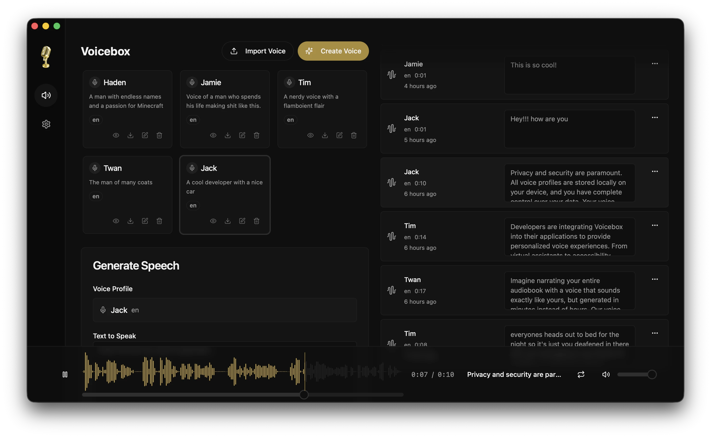

<p align="center">
  
</p>

# VibeTube

<p align="center">
  <a href="LICENSE"></a>
  
  
  
</p>

Local-first voice cloning, character creation, story assembly, and talking-character rendering.

> VibeTube started from a fork/vendor of [Voicebox](https://github.com/jamiepine/voicebox). Huge credit to the original project. This repo now evolves that foundation into VibeTube's own workflow and UI.

VibeTube is a local-first app for building voice-driven character content with a React frontend and a FastAPI backend. In development it runs as a web app against a local server; in packaged use it runs as a Tauri desktop app with a bundled backend. The current product centers on Characters, Generate, Stories, Broadcast, and VibeTube rendering, with support for local runtime by default and configurable server connections where needed.

<p align="center">
  
</p>

## Demo

[](https://youtu.be/Oco9v5mhcpg?si=VhFm2XoPrfx1EYQc)

Watch the current app demo on YouTube: https://youtu.be/Oco9v5mhcpg?si=VhFm2XoPrfx1EYQc

This walkthrough predates the current Broadcast feature. Broadcast is already available in the app, and a newer demo video will be added later.

## What VibeTube Includes

### Characters

- Create and edit characters from voice samples
- Attach avatar images and VibeTube avatar state packs
- Import and export voice-profile data where supported
- Assign characters to channels for generation workflows

### Generate

- Generate speech with the Qwen3-TTS-backed workflow
- Reuse saved characters in the main generation flow
- Review generation history and replay outputs locally
- Download generated audio from the app

### Stories

- Build multi-clip, multi-character story compositions
- Arrange clips in a timeline/track editor
- Reuse generated clips inside story workflows
- Keep story editing separate from one-off generations

### Broadcast

- Use your avatar as a PNGTuber in live sessions
- Stream VibeTube output into OBS Studio
- Drive avatar speaking states from your voice in real time
- Use Broadcast as a live workflow separate from offline render exports

### VibeTube Rendering

- Render talking-character output from avatar states
- Tune render settings for motion, timing, and output size
- Use background color or uploaded background images
- Support character/video workflows, not just standalone audio

### Transcription and Audio Capture

- Record audio inside the app
- Transcribe audio with Whisper-backed tooling
- Capture system audio where the platform supports it
- Manage model downloads needed for transcription and generation

### Runtime and Model Management

- Bundled backend in packaged desktop builds
- Separate backend process in development
- Model download, status, and cache management
- Local-first operation with configurable server connection settings

## Download

Windows installers are available from the latest GitHub release. macOS and Linux packaged downloads are not published yet.

| Platform | Download |
| --- | --- |
| macOS | TBD |
| Windows | [Latest release](https://github.com/VibeCreAI/VibeTube/releases/latest) |
| Linux | TBD |

## Development

For full setup and contribution details, see [CONTRIBUTING.md](CONTRIBUTING.md) and [DEV_RUN.md](DEV_RUN.md).

### Quick local run

Prerequisites:

- [Bun](https://bun.sh)
- [Python 3.11+](https://python.org)
- [Rust](https://rustup.rs) for Tauri development only

```bash
# Install JavaScript dependencies
bun install

# Create and activate a Python virtual environment
python -m venv .venv

# Windows PowerShell
.\.venv\Scripts\Activate.ps1

# macOS / Linux
source .venv/bin/activate

# Install backend dependencies
pip install -r backend/requirements.txt

# Start the backend on http://127.0.0.1:17493
python -m uvicorn backend.main:app --host 127.0.0.1 --port 17493 --reload

# In another terminal, start the web app on http://127.0.0.1:5173
bun run dev:web -- --host 127.0.0.1
```

### Desktop app

```bash
# Starts the Tauri app in development mode
bun run dev
```

In development, the desktop app expects the backend to be started separately. In packaged desktop builds, the backend is bundled and started by the app.

## API

VibeTube exposes a FastAPI backend for the same core workflows used by the app:

- characters / voice profiles
- generation
- transcription
- stories
- models
- active task tracking

When the backend is running locally, interactive API docs are available at:

- `http://127.0.0.1:17493/docs`

## Project Structure

```text
VibeTube/
|-- app/         # Shared application UI
|-- web/         # Web wrapper/runtime
|-- tauri/       # Desktop wrapper/runtime
|-- backend/     # FastAPI backend and model orchestration
|-- docs/        # Documentation site content
|-- scripts/     # Build and maintenance scripts
`-- legacy_cli/  # Archived legacy CLI work
```

## Contributing

Contribution guidelines live in [CONTRIBUTING.md](CONTRIBUTING.md).

## Security

Security reporting information is in [SECURITY.md](SECURITY.md).

## License

VibeTube is released under the MIT License. See [LICENSE](LICENSE).
For an informational responsibility notice that does not alter the MIT terms, see [DISCLAIMER.md](DISCLAIMER.md).
